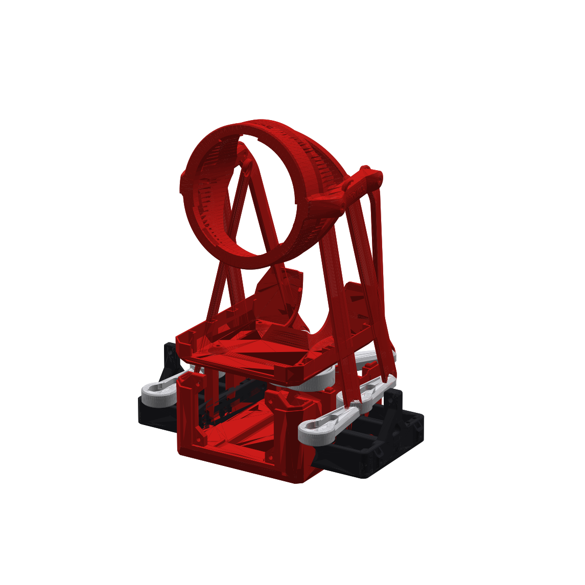
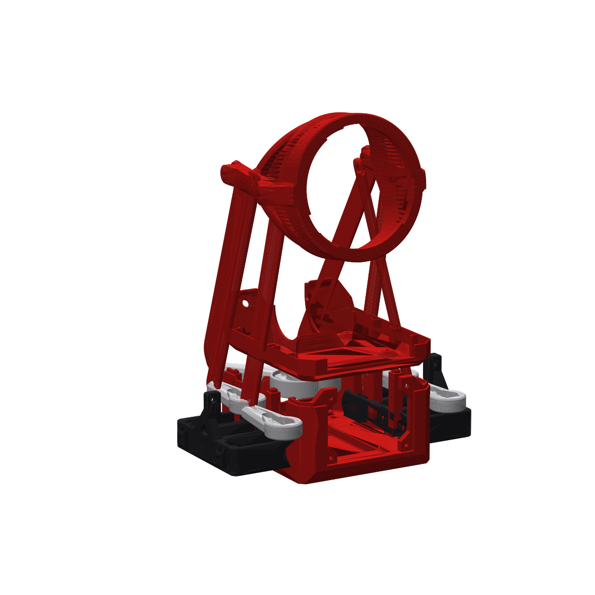
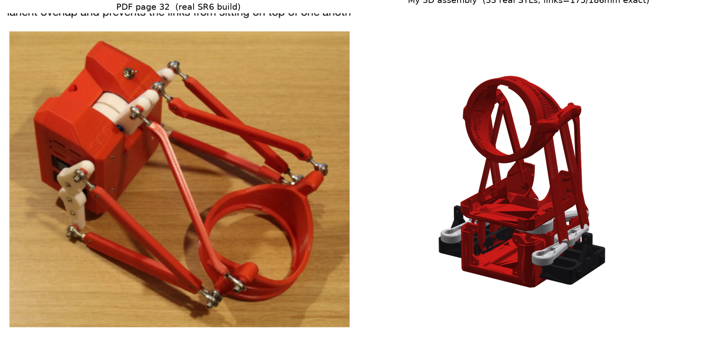

# SR6 物理装配闭环 (Phase 2)

把 33 个真实 STL 零件按 PDF《SR6 Build Instructions》教程在虚拟机上装配成整机
3D 模型，使 6 根连杆长度精确等于设计值（主腿 175mm / 俯仰腿 186mm），并与 PDF
第 32 页成品照做拓扑/配色比对。

不同于 Phase 1（固件 IK / 3D FK 的运动学闭环），本阶段是**几何装配闭环**：
真实零件的实测几何 → 世界位姿 → 连杆长度约束严格成立 → 与成品图一致。

## 闭环判据（道法自然·测量驱动，不靠猜测）

| 判据 | 结果 |
|------|------|
| 6 根连杆长度 = 175/186mm | 最坏误差 **2.84e-13 mm** |
| 接收环 home 位姿为刚体变换 | det(R)=1, R·Rᵀ=I ✓ |
| 4 主臂落在实测舵机轴上 | 左臂以共享对称臂 STL 沿 X 镜像放置（正交，det=−1）|
| 连杆-连杆 / 连杆-箱体 无干涉 | 最小间隙 > 7.4mm ✓ |
| 与 PDF p32 成品图 | 拓扑/配色/比例一致 |

## 装配方法（测量驱动）

1. **结构件**（底座/盖子/L,R 框架）：共享 CAD 帧，恒等变换，不重定位。
2. **舵机轴**：从框架 STL 孔位实测得 6 个轴心世界坐标（见 `assembly_transforms.json` 的 `servo`）。
3. **臂**：放到实测舵机轴上、按 home 角定向；左侧臂为对称臂 STL 沿 X 镜像。
4. **接收环**：6 自由度（3 平移 + 3 欧拉角）最小二乘求解 home 位姿，
   使 6 根 臂球→接收环销 的距离精确等于 175/186mm（`assemble.py`，RMS 0.00mm）。
5. **连杆**：把真实连杆 STL 的两端球心刚性映射到 臂球↔接收环销 线段上（无缩放）。

求解结果：接收环 t≈(0, −22.6, 215.5)mm，绕 X 轴 ≈ −98°（通电中位，环沿推力轴正向伸出；
PDF 照片是断电松弛态，环垂向斜挂——同一机构、不同驱动状态）。

## 文件

| 文件 | 作用 |
|------|------|
| `partmap.py` | 零件键→STL 路径（懒解析，未设 `SR6_STL_ROOT` 也能 import）|
| `assemble.py` | 测量驱动求解器：解接收环 6-DOF home 位姿，写 `assembly_transforms.json` |
| `render.py` | 读变换 JSON，把 33 个网格摆到位姿，渲染 5 视图 + 导出 GLB |
| `interference.py` | 连杆长度 / 连杆-连杆 / 连杆-箱体 间隙自检（scipy cKDTree）|
| `verify_assembly.py` | **CI 友好**校验：无需 STL，校验 6 连杆长度 + 刚体性质 |
| `assembly_transforms.json` | 求解出的全部世界变换 + 连杆长度（CI 真值）|
| `renders/` | 5 视图 PNG + `compare_pdf_vs_model.png` + `sr6_assembly.glb` |

## 复现

```bash
# 仅校验闭环（无需 STL，CI 即跑此条）
python verify_assembly.py

# 完整重建（需真实 STL）
export SR6_STL_ROOT="/path/to/extracted/STLs"
python assemble.py        # 重解 assembly_transforms.json
python render.py          # 重渲染 + 导出 GLB
python interference.py    # 干涉自检
```

STL 为大文件，**不入库**；`assembly_transforms.json` 已固化全部变换，CI 据此验证。

## 渲染




